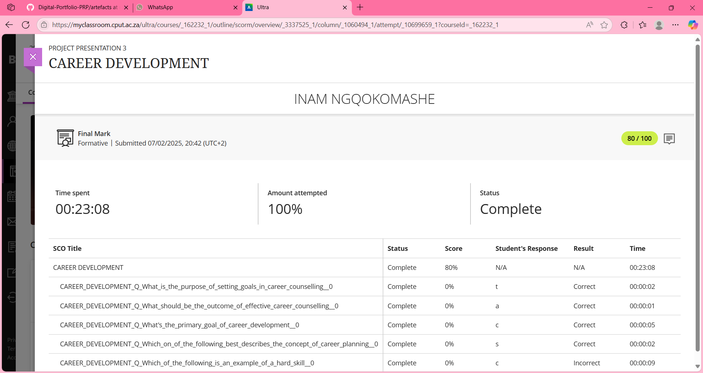
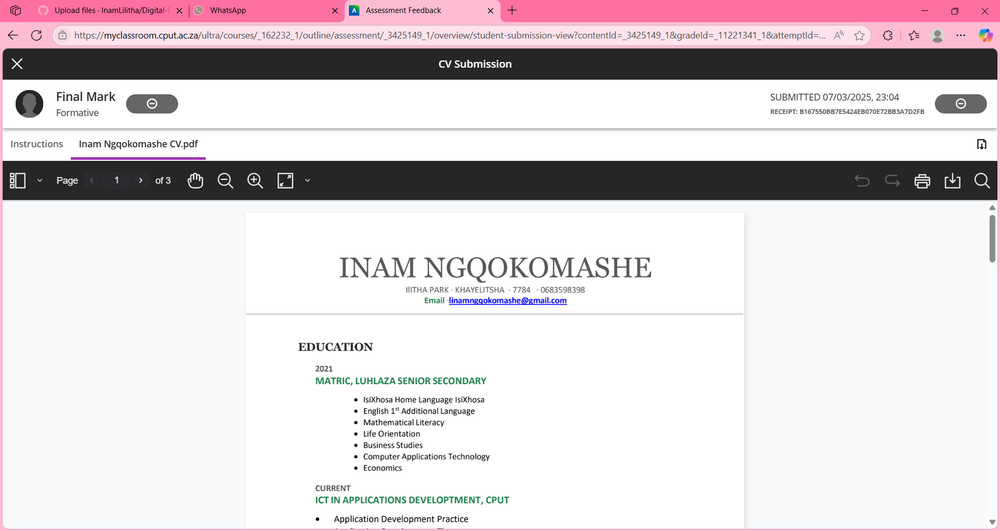

# Digital Portfolio

## Career Development

### Evidence
  

### Reflection (STAR)
**Situation**:  
The Session happened in early February.

**Task**:  
I needed guidance on creating a career development plan.

**Action**:  
I engaged by asking specific questions about setting SMART goals and exploring various career paths.

**Result**:  
I learned how to outline actionable steps toward my career aspirations, significantly enhancing my planning skills.

---

## Skills and Interests

### Evidence

### Reflection (STAR)
Reflecting on a recent group project, I utilized my communication skills effectively.

**Situation**:  
In a team project for my project class, we developed a web-app.

**Task**:  
I was responsible for facilitating team discussions.

**Action**:  
I organized meetings and encouraged all members to share their ideas.

**Result**:  
This approach led to a well-crafted web-app that received high praise from our professor.

---

## Personality Assessment

### Evidence
*Assessment Result: MBTI Type: ENFJ*

## Create a CV

### Evidence

### Reflection (STAR)
**Situation**:  
I started building my CV last semester to prepare for internships.

**Task**:  
I aimed to effectively showcase my experiences and skills.

**Action**:  
I researched CV formats and incorporated feedback from peers and mentors.

**Result**:  
I have not received any interview invitations but I have beeen submitting my cv for potential internships.

